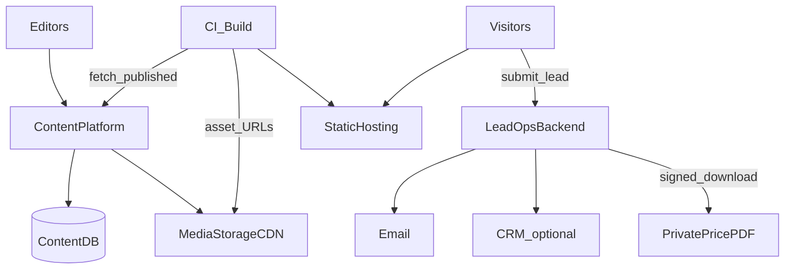
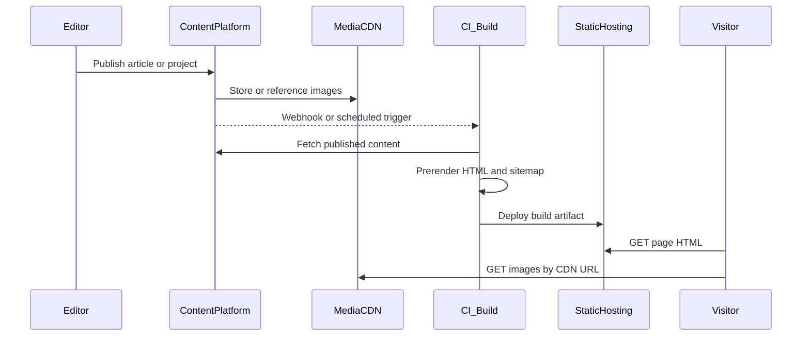
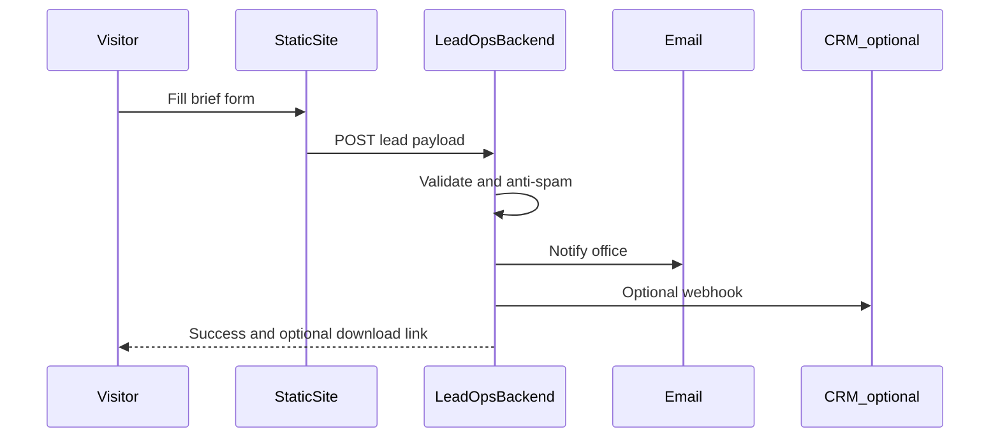
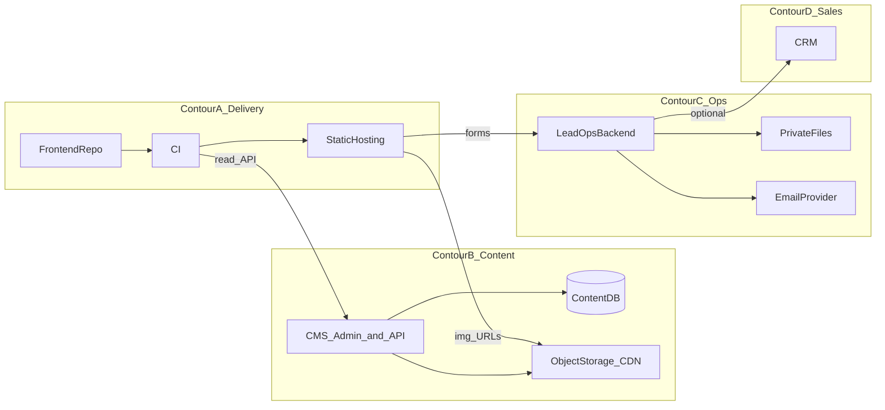

# Целевая архитектура проекта Анфас

| Поле | Значение |
|------|----------|
| Тип документа | Target Architecture / Architecture Overview |
| Проект | anfas-react-site (сайт Анфас) |
| Версия | 1.0 |
| Дата | 2026-07-30 |
| Горизонт | 1–2 года |
| Статус | Draft for review |
| Изменения кода | Не выполнялись |

> Документ описывает **целевое** устройство системы после постепенной эволюции.  
> Это архитектурный ориентир для технических решений, а не план внедрения и не выбор конкретных вендоров.

Операционные документы текущего контура (деплой, почта заявок) остаются справочными для *сегодняшнего* продакшена и не задают целевую модель сами по себе.

---

## Содержание

1. [Назначение и принципы](#1-назначение-и-принципы)
2. [Общая архитектура системы](#2-общая-архитектура-системы)
3. [Подсистемы и ответственность](#3-подсистемы-и-ответственность)
4. [Слои Frontend](#4-слои-frontend)
5. [Где хранятся данные](#5-где-хранятся-данные)
6. [Потоки данных](#6-потоки-данных)
7. [Публикация статей журнала](#7-публикация-статей-журнала)
8. [Проекты и изображения](#8-проекты-и-изображения)
9. [Обработка заявок](#9-обработка-заявок)
10. [Прайс-лист](#10-прайс-лист)
11. [Деплой](#11-деплой)
12. [Инфраструктура целиком](#12-инфраструктура-целиком)
13. [Границы и запреты](#13-границы-и-запреты)
14. [Критерии соответствия решения](#14-критерии-соответствия-решения)

---

## 1. Назначение и принципы

### 1.1. Что это за система

Маркетинговый сайт компании Анфас: витрина услуг, портфолио проектов, журнал как SEO-канал, формы заявок, защищённая выдача полного прайса после лида.

Система **не** является интернет-магазином, личным кабинетом клиента или платформой онлайн-оплаты.

### 1.2. Продуктовые рамки на горизонте 1–2 лет

| Область | Целевое ожидание |
|---------|------------------|
| Тип сайта | Маркетинговый |
| Услуги | Небольшой, почти закрытый каталог |
| Основные страницы / дизайн | Стабильны; кардинальных перестроек не планируется |
| Журнал | Основная точка роста и SEO (~регулярные публикации) |
| Проекты | Вторая точка роста; кейсы с большим числом изображений |
| Магазин / корзина / оплата / ЛК | Отсутствуют |

### 1.3. Архитектурные принципы

1. **Эволюция, не переписывание.** Сохраняются React Router Framework Mode, FSD-слои и prerender (`ssr: false` как базовая модель отдачи маркетинговых страниц).
2. **Разделение витрины и редакции.** Посетитель получает быструю статику; редактор работает в CMS, а не в репозитории TypeScript.
3. **Растущий контент — вне git.** Статьи, карточки проектов и медиа живут в контентной платформе и файловом хранилище.
4. **Стабильный контент — в коде.** Услуги, процесс, FAQ, legal и copy утверждённых витринных страниц остаются во frontend.
5. **SEO через prerender.** Индексируемый HTML строится на этапе сборки (или эквивалентного rebuild после публикации); SSR не обязателен.
6. **Тонкий ops-backend.** Приём заявок, антиспам, уведомления и выдача private PDF — отдельный операционный контур, не «монолит приложения».
7. **CMS не диктует вёрстку.** Дизайн-система и UI живут во frontend; CMS отдаёт структурированные данные и URL медиа.
8. **Без commerce-контура.** Нет каталога SKU, корзины, платежей и пользовательских аккаунтов.

### 1.4. Non-goals документа

Документ **не** фиксирует:

- конкретную CMS, облако или язык ops-backend;
- сроки, фазы и оценки стоимости внедрения;
- сравнение с текущим техдолгом или аудит «как есть».

---

## 2. Общая архитектура системы

Целевая система — **гибрид**:

- маркетинговый frontend остаётся статически собираемым сайтом с prerender;
- контент журнала и проектов обслуживается контентной платформой (CMS + БД);
- медиа отдаётся из object storage / CDN;
- заявки и private-файлы обрабатывает lead/ops backend;
- продажи при необходимости принимают лиды в CRM (вне витрины).



### Логические контуры

| Контур | Назначение |
|--------|------------|
| **A. Delivery** | Сборка и раздача маркетинговой статики посетителям |
| **B. Content** | Редакция, хранение статей/проектов, медиа |
| **C. Ops** | Заявки, почта/CRM, private PDF |
| **D. Sales** | Работа менеджеров с лидами (CRM) — вне UI сайта |

Контуры связаны контрактами (HTTP API, webhook, signed URL), а не общим монолитным процессом.

---

## 3. Подсистемы и ответственность

### 3.1. Frontend (marketing site)

**Ответственность:**

- маршруты, SEO meta, prerender entrypoints;
- UI витрины, журнала, проектов, услуг, форм;
- клиентская навигация SPA после первой загрузки;
- обращение к данным через repository-интерфейсы сущностей.

**Не ответственность:**

- хранение редакторского контента;
- SMTP и секреты;
- хранение бинарных галерей;
- бизнес-процесс CRM.

### 3.2. Content platform (CMS + Content DB)

**Ответственность:**

- модели статей и проектов (поля, статусы draft/published, SEO-поля);
- админ-UI для редакторов;
- read API опубликованного контента для CI/сборки;
- учёт ссылок на медиа (не обязательно сами байты файлов).

**Не ответственность:**

- вёрстка страниц сайта;
- приём публичных заявок с формами антиспама (это ops);
- раздача маркетинческого HTML посетителям.

Конкретный продукт CMS **не выбирается** этим документом: фиксируется роль «headless content platform with admin UI and content database».

### 3.3. Media storage / CDN

**Ответственность:**

- хранение обложек статей и галерей проектов;
- публичная (или подписанная) отдача изображений с CDN;
- разгрузка git и FTP-статики от роста бинарников.

### 3.4. Lead / ops backend

**Ответственность:**

- приём заявок с сайта;
- валидация, rate limit, honeypot/timing и аналогичные меры;
- уведомление офиса (email и/или CRM webhook);
- подтверждение клиенту при необходимости;
- выдача полного прайса по временной подписанной ссылке;
- хранение секретов (SMTP, HMAC) только на сервере.

Стек (PHP на том же edge, отдельный сервис на VPS и т.д.) — решение реализации, не целевой модели.

### 3.5. Static hosting / CDN края сайта

**Ответственность:**

- раздача HTML/JS/CSS/шрифтов артефакта сборки;
- rewrite для SPA-маршрутов там, где нет prerender-файла;
- (опционально) colocated публичные API endpoints ops, если выбран такой ops-контур.

### 3.6. CRM (опционально)

**Ответственность:** воронка продаж, статусы лидов, повторные касания.  
**Не часть** frontend и не замена CMS.

---

## 4. Слои Frontend

Направление зависимостей сохраняется:

```text
routes → widgets → features → entities → shared
```

Нижележащий слой не импортирует вышележащий. Глобальная инициализация — в `app`.

| Слой | Ответственность в целевой модели |
|------|----------------------------------|
| `app` | Providers, глобальная инициализация |
| `routes` | URL, metadata, loaders, композиция страниц, точки prerender |
| `widgets` | Крупные блоки страниц (home, blog, projects, header, footer, …) |
| `features` | Сценарии пользователя: заявка (brief), FAQ и аналогичные |
| `entities` | Доменные сущности и **repository interfaces** |
| `shared` | UI kit, стили, hooks, SEO-хелперы, конфиг без секретов |

### 4.1. Entities и источники данных

| Сущность | Целевой источник | Как подключается |
|----------|------------------|------------------|
| `article` | Content platform | Реализация repository читает published API на этапе сборки (и при необходимости runtime) |
| `project` | Content platform + media URLs | То же |
| `service` | Код frontend (локальные data-модули) | `local*Repository` остаётся нормой |
| Витринный copy / process / FAQ / legal | Код frontend | Без обязательного выноса в CMS |

UI и route-компоненты зависят от **интерфейсов** репозиториев, а не от конкретной CMS. Смена провайдера контента не требует переписывания виджетов.

### 4.2. Состояние

- локальный UI — React;
- URL — React Router;
- server/async state — по мере появления удалённых запросов (например TanStack Query), без обязательного глобального store;
- Redux/Zustand — только при отдельной сложной задаче.

### 4.3. Рендеринг

- Базовая модель: **`ssr: false` + явный список prerender URL**.
- Холодный заход на prerender-страницы отдаёт готовый HTML.
- Клиентские переходы — SPA.
- Полноценный Node SSR **не является** целевым требованием; допустим как опция хостинга, если не ломает остальную модель.

---

## 5. Где хранятся данные

| Данные | Целевое хранение | Комментарий |
|--------|------------------|-------------|
| Статьи журнала, категории, SEO-поля статей | CMS + Content DB | Основной растущий контент |
| Проекты, отзывы, метаданные галерей | CMS + Content DB | Второй растущий контент |
| Изображения статей и проектов | Media storage + CDN | В CMS — ссылки/ассеты, не git |
| Услуги | Frontend (код) | Мало записей, каталог почти закрыт |
| Процесс, FAQ, партнёры, legal, copy витрины | Frontend (код) | Редкие правки |
| Заявки (оперативный поток) | Lead/ops backend → email; опционально CRM или таблица заявок | Без пользовательских аккаунтов |
| Полный прайс (PDF) | Private storage ops-контура | Нет постоянного публичного URL |
| Превью прайса на сайте | Frontend (или редкая контентная запись) | Публичный полный PDF запрещён |
| Секреты (SMTP, HMAC, API keys) | Только сервер ops / CI secrets | Не в `VITE_*` и не в клиентском бандле |
| Артефакт сайта | Static hosting | Результат CI build |

---

## 6. Потоки данных

### 6.1. Контент → сайт (read path)



Сборка является **моментом материализации** журнала и проектов в статический сайт. После деплоя посетитель не обязан ходить в CMS runtime для базового SEO-контента.

### 6.2. Заявка (write path)



### 6.3. Граница ответственности в потоках

- Frontend формирует UX и payload заявки.
- CMS владеет редакционным жизненным циклом контента.
- CI владеет согласованностью prerender + sitemap с опубликованным набором URL.
- Ops backend владеет побочными эффектами (почта, signed URL, интеграция с CRM).

---

## 7. Публикация статей журнала

Журнал — **главный контентный контур** целевой архитектуры.

### 7.1. Модель

| Аспект | Целевое устройство |
|--------|--------------------|
| Хранение | Запись в CMS / Content DB |
| Статусы | Как минимум draft и published |
| Поля | Заголовок, slug, тема/категория, тело, обложка, SEO title/description, дата публикации |
| URL на сайте | `/blog`, `/blog/:slug` — схема сохраняется |
| Обложки | Media storage; в статье — URL |
| Список и фильтры | Строятся из published API на сборке (и/или клиенте) |

### 7.2. Целевой пайплайн публикации

1. Редактор создаёт/правит статью в CMS.  
2. Статья проходит статус published.  
3. Триггер (webhook CMS → CI или эквивалент) запускает сборку.  
4. Сборка забирает все published статьи, обновляет prerender-список и sitemap.  
5. Артефакт выкладывается на static hosting.  
6. Посетители и поисковые боты получают актуальный HTML.

### 7.3. Требования к качеству контура

- Публикация **не** требует ручного редактирования TypeScript data-файлов.
- Новый slug автоматически попадает в prerender/sitemap через пайплайн, а не через забытый чеклист.
- Черновики не попадают в публичный API, используемый сборкой.

---

## 8. Проекты и изображения

Проекты — **вторая точка роста**; акцент архитектуры — на медиа.

### 8.1. Карточка проекта

Хранится в CMS: идентификатор/slug, тексты, характеристики, отзыв, упорядоченный список изображений (URL), SEO-поля.

URL на сайте (например `/projects/:slug`) сохраняют стабильную схему маршрутов frontend.

### 8.2. Изображения

| Правило | Смысл |
|---------|--------|
| Не git как медиатека | Исходники и веб-версии галерей не накапливаются в репозитории как основной store |
| Object storage + CDN | Отдача и масштаб |
| CMS как каталог ассетов | Редактор загружает и привязывает файлы к проекту |
| Frontend показывает URL | Виджеты галереи потребляют готовые адреса, без локального `import` сотен файлов |

### 8.3. Поток добавления проекта

1. Загрузка изображений в media.  
2. Создание/публикация проекта в CMS со ссылками на ассеты.  
3. Rebuild сайта (тот же класс пайплайна, что у журнала).  
4. Появление кейса в списке и на детальной странице после деплоя.

---

## 9. Обработка заявок

### 9.1. Цель контура

Собрать лид с маркетингового сайта и доставить его менеджерам **без** регистрации пользователя и без ЛК.

### 9.2. Целевое устройство

| Элемент | Роль |
|---------|------|
| UI формы | Feature во frontend (единый brief/заявка) |
| Transport | HTTPS POST на Lead/ops API |
| Обработка | Валидация схемы, антиспам, нормализация intent (услуга, прайс, общий бриф, …) |
| Доставка | Email офису; опционально CRM |
| Ответ клиенту | Успех в UI; при прайсе — временная ссылка на PDF |
| Хранение истории | Email как минимум; при росте объёма — CRM или таблица заявок в ops-хранилище |

### 9.3. Чего нет в целевой модели заявок

- аккаунтов клиентов;
- статусов заказа в UI сайта;
- оплаты и корзины;
- публичной загрузки произвольных файлов пользователем без отдельной защищённой модели.

---

## 10. Прайс-лист

### 10.1. Разделение публичного и полного прайса

| Часть | Где живёт | Доступ |
|-------|-----------|--------|
| SEO-хаб и превью категорий/позиций | Статический сайт (frontend data или редкий контент) | Публично |
| Полный PDF | Private storage ops-контура | Только после заявки, по TTL / signed URL |
| Метаданные файла (версия, дата) | Ops или сопутствующая запись | Для писем и контроля актуальности |

### 10.2. Целевой сценарий выдачи

1. Пользователь оставляет заявку с intent «прайс» (или эквивалент).  
2. Ops backend принимает лид, уведомляет офис, при необходимости пишет клиенту.  
3. Генерируется временная ссылка на PDF.  
4. Скачивание идёт через ops endpoint с проверкой подписи и срока.  
5. Постоянный публичный URL полного прайса **не** публикуется и не попадает в sitemap.

### 10.3. Обновление файла

Замена PDF — операционная процедура ops-контура (загрузка private-файла), не обязательно полный релиз frontend. Превью на сайте обновляется отдельно, если меняется публичная витрина цен.

---

## 11. Деплой

### 11.1. Два независимых контура поставки

| Контур | Что деплоится | Триггер |
|--------|---------------|---------|
| **Marketing site** | Артефакт frontend-сборки (HTML/JS/CSS) + при необходимости colocated ops endpoints | CI: push в репозиторий UI **или** webhook публикации контента |
| **Content & media** | CMS, Content DB, media bucket | Отдельный ops/release контура B |
| **Lead/ops** | Сервис заявок и private PDF (если не совмещён с краем статики) | Отдельный или совмещённый с краем |

### 11.2. Сборка marketing site

Целевой build:

1. Установка зависимостей frontend.  
2. Fetch published articles/projects из Content API.  
3. Генерация prerender HTML для фиксированных и контентных URL.  
4. Генерация/обновление sitemap.  
5. Выкладка артефакта на static hosting.

Секреты CMS/API для сборки — только в CI, не в клиентском бандле.

### 11.3. Согласованность SEO

После публикации контента сайт считается актуальным, когда **завершён** цикл rebuild + deploy. Документ допускает короткий лаг «published в CMS → ещё не в статике»; архитектура обязана делать этот лаг управляемым (автотриггер), а не ручным.

---

## 12. Инфраструктура целиком



### 12.1. Роли узлов

| Узел | Класс (без вендора) |
|------|---------------------|
| Static hosting | Хостинг статики / CDN края |
| CI | Сборка и деплой артефакта |
| CMS + Content DB | Runtime контентной платформы |
| Object storage + CDN | Медиа |
| Lead/ops backend | Небольшой серверный runtime |
| Email / CRM | Внешние сервисы уведомлений и продаж |

### 12.2. Сетевые границы

- Публично: static site, CDN медиа (публичные ассеты), lead endpoint.  
- Защищено auth: CMS admin, private PDF download (token/TTL), панели CRM.  
- Content read API для CI: по секрету или сетевым ограничениям, не для анонимной записи.

### 12.3. Наблюдаемость (принципы)

Целевая архитектура предполагает возможность видеть:

- успешность/ошибки lead endpoint;
- факт и результат rebuild после publish;
- доступность CMS и media;
- истечение и отказы signed URL прайса.

Конкретный стек мониторинга не фиксируется.

---

## 13. Границы и запреты

Целевая архитектура **явно исключает**:

- интернет-магазин, корзину, онлайн-оплату, каталог товаров как commerce;
- личный кабинет клиента и пользовательские аккаунты на сайте;
- обязательный перенос услуг и всей витрины в CMS «на всякий случай»;
- git как основное хранилище галерей проектов;
- постоянный публичный URL полного прайс-PDF;
- переписывание сайта на другой UI-фреймворк ради смены бэкенда контента;
- обязательный SSR как условие SEO;
- публичный upload файлов посетителями без отдельной модели безопасности.

Целевая архитектура **сохраняет**:

- React Router Framework Mode;
- FSD и направление `routes → widgets → features → entities → shared`;
- prerender как основу SEO-отдачи;
- единый UX заявок на сайте;
- стабильные публичные URL журнала и проектов.

---

## 14. Критерии соответствия решения

Новое техническое решение **соответствует** целевой архитектуре, если:

1. Не ломает модель marketing site + prerender + FSD без явной архитектурной ревизии.  
2. Не вводит commerce, ЛК или платежи.  
3. Кладёт растущий редакционный контент (статьи, проекты) в Content platform, а не в раздуваемые frontend data-файлы.  
4. Кладёт изображения портфолио/обложек в media storage / CDN, а не в git как primary store.  
5. Оставляет малоизменяемые услуги и витринный copy во frontend, пока нет отдельного продуктового требования.  
6. Проводит заявки через Lead/ops backend с серверными секретами.  
7. Выдаёт полный прайс только через контролируемый private/signed механизм.  
8. Обеспечивает путь «publish в CMS → обновление статики/sitemap» без ручного правления TypeScript на каждую статью.  
9. Не требует от CMS управлять вёрсткой; frontend остаётся владельцем UI.  
10. Не фиксирует вендора там, где достаточно роли подсистемы — выбор инструмента выносится в отдельное решение о реализации.

---

## Статус документа

| Поле | Значение |
|------|----------|
| **Версия** | 1.0 |
| **Статус** | Draft for review → после согласования: Approved |
| **Изменение кода** | Не выполнялось |
| **Назначение** | Единый ориентир целевой архитектуры на горизонт 1–2 года |

---

*Конец документа.*
